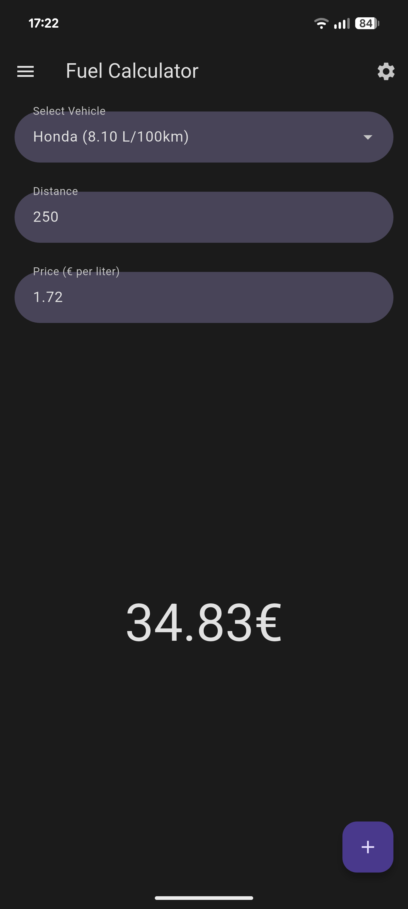
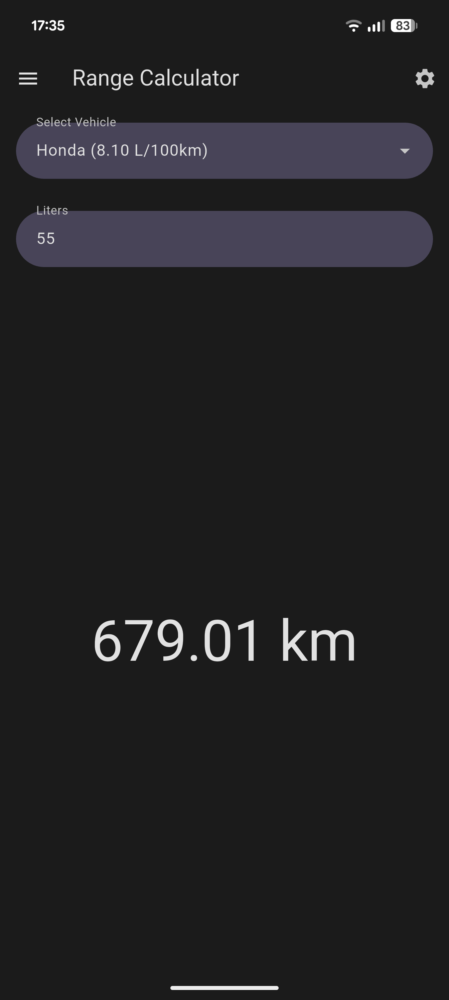
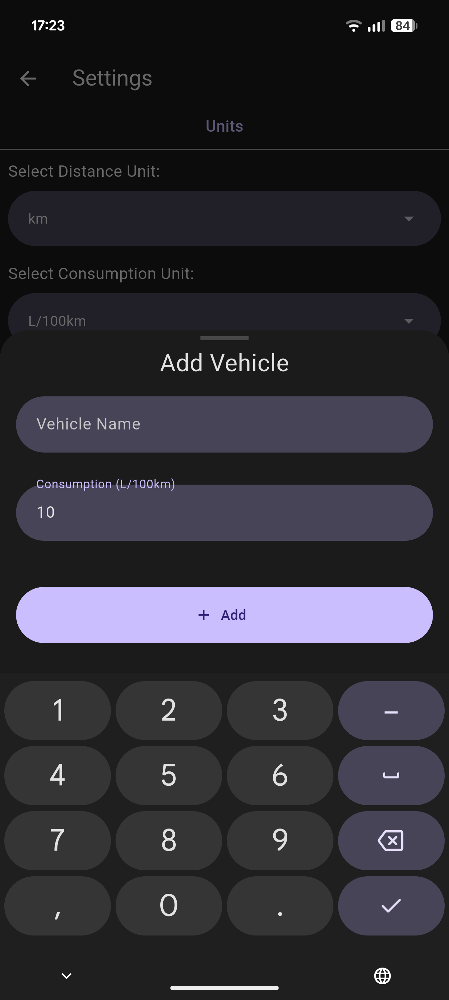
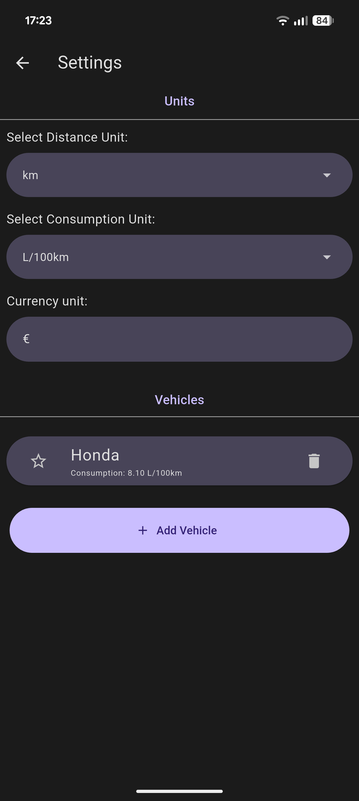

# Open Fuel Calculator

  
  
  
  

## About
An app to calculate how much the fuel for a trip will cost.

I'm making this app because all the ones on the Play Store don't have the features I want (like saving your vehicles and their consumption).

## Made with
The app is made with Flutter ([documentation](https://docs.flutter.dev/)).
